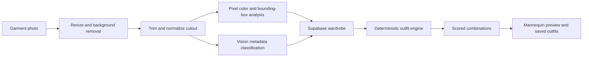

# AI Stylist

An intelligent wardrobe workspace that turns clothing photos into a structured digital closet and generates explainable outfit combinations.

[](https://react.dev/)
[](https://www.typescriptlang.org/)
[](https://supabase.com/)
[](https://vite.dev/)

AI Stylist combines vision-assisted garment classification with deterministic image and color analysis. AI labels garment attributes once during upload; exact colors, image framing, deduplication, and outfit scoring are handled locally to reduce cost and avoid unnecessary model-generated guesses.

## Highlights

- Upload and manage a private digital wardrobe
- Remove image backgrounds in the browser
- Correct phone-photo orientation and rotate garments manually
- Frame garment cutouts consistently for a product-style catalog
- Classify category, garment type, pattern, style, season, material, and fit
- Extract dominant colors directly from pixels using CIELAB k-means
- Detect duplicate uploads with SHA-256 content hashes
- Generate outfits locally with deterministic compatibility rules
- Score color harmony, season, formality, pattern, and garment type
- Visualize proportional garments on a mannequin
- Save favorite outfits and remove outfits when referenced items are deleted
- Protect user data with Supabase Auth and Row Level Security

## Design approach



### AI where it helps

The Supabase `analyze-clothing` Edge Function uses a vision model to classify semantic attributes that are difficult to derive from pixels alone.

### Deterministic processing where accuracy matters

- Colors come from garment pixels rather than model guesses.
- Outfit generation runs locally without an AI request.
- Content hashes prevent repeated processing and storage for identical uploads.
- Alpha bounds control garment scale and positioning on the mannequin.
- Saved-outfit cleanup is enforced by a database trigger when clothing is deleted.

## Technology

| Layer | Technology |
| --- | --- |
| Frontend | React 18, TypeScript, Vite |
| Styling | Tailwind CSS |
| Authentication | Supabase Auth |
| Database | Supabase PostgreSQL |
| Storage | Supabase Storage |
| Server functions | Supabase Edge Functions |
| Vision classification | Groq-compatible multimodal model |
| Background removal | `@imgly/background-removal` |
| Image analysis | Canvas API, SHA-256, CIELAB color clustering |
| Outfit engine | Local deterministic TypeScript rules |

## Project structure

```text
src/
├── components/
│   ├── AuthView.tsx
│   ├── WardrobeView.tsx
│   ├── OutfitsView.tsx
│   └── Mannequin.tsx
├── lib/
│   ├── imageTools.ts       Image normalization, hashing, colors, and bounds
│   ├── outfitEngine.ts     Deterministic outfit generation and scoring
│   └── supabase.ts
└── App.tsx
supabase/
├── functions/
│   └── analyze-clothing/   Vision metadata classification
└── migrations/             Schema, RLS, storage, deduplication, and cleanup
```

## Local development

### Prerequisites

- Node.js 18 or newer
- npm
- A Supabase project
- A Groq API key or compatible configured vision provider

### Installation

```bash
git clone https://github.com/AmmarBinYasir489/Ai-stylist.git
cd Ai-stylist
npm install
```

The clone URL above matches the current GitHub repository.

Create `.env`:

```env
VITE_SUPABASE_URL=your_supabase_project_url
VITE_SUPABASE_ANON_KEY=your_supabase_anon_key
```

Start the frontend:

```bash
npm run dev
```

Open [http://localhost:5173](http://localhost:5173).

## Supabase setup

1. Link the project with the Supabase CLI.
2. Apply the migrations in `supabase/migrations/`.
3. Set the server-only model credentials:

```bash
supabase secrets set GROQ_API_KEY=your_key
supabase secrets set GROQ_VISION_MODEL=qwen/qwen3.6-27b
```

4. Deploy the active analysis function:

```bash
supabase functions deploy analyze-clothing
```

Never expose the Groq key through a `VITE_` variable. Only public Supabase client configuration belongs in the frontend environment.

## Verification

```bash
npm run lint
npm run typecheck
npm run build
```

## Privacy and cost controls

- The Groq key remains inside the Supabase Edge Function.
- Vision AI is used during new-item classification, not during every outfit request.
- Re-uploading the same image can reuse the content hash and avoid duplicate processing.
- Outfit generation runs locally and does not send the wardrobe back to a language model.
- Uploaded wardrobe images and records should remain protected by the included per-user policies.

## Roadmap

- Weather-aware recommendations
- Occasion profiles and reusable dress codes
- Personal preference learning
- Automated tests for image analysis and outfit scoring
- Mobile-first capture flow
